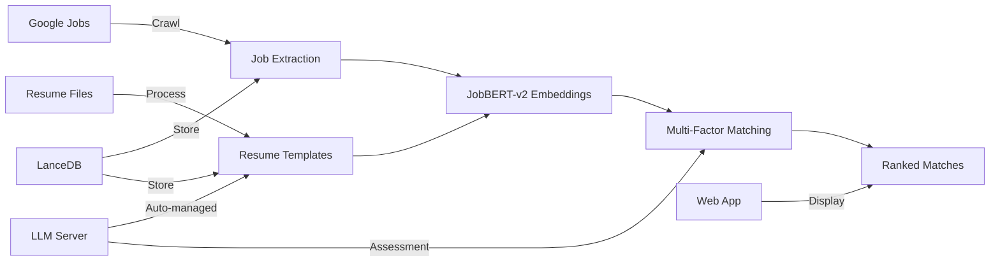

# VocationVector

An intelligent job matching system that automatically crawls Google Jobs, processes resumes, and matches candidates to positions using advanced AI techniques. Features automatic LLM server management, JobBERT-v2 embeddings for job-specific understanding, and multi-factor scoring for optimal matches.

## Key Features

- **Automatic Job Crawling**: Extracts job listings from Google Jobs with full text expansion
- **Smart Resume Processing**: Two-pass LLM approach for structured data extraction  
- **Intelligent Matching**: Multi-factor scoring using JobBERT-v2 embeddings + LLM assessment
- **Web Application**: Flask-based UI with real-time matching and WebSocket support
- **Automatic Server Management**: llama.cpp server starts/stops automatically as needed
- **Unified Storage System**: LanceDB for all operations
- **Caching System**: Query and embedding caching for improved performance

## How It Works



The system:
1. **Crawls** job listings from Google Jobs using Playwright
2. **Processes** resumes using a two-pass LLM approach for structured extraction
3. **Generates** JobBERT-v2 embeddings for semantic understanding
4. **Calculates** match scores across multiple factors with configurable weights
5. **Stores** data in LanceDB vector database
6. **Presents** results via Flask web application or command-line interface

## Installation

### Prerequisites
- Python 3.11+
- Windows/Linux/Mac
- 8GB+ RAM recommended
- GPU optional but recommended for faster processing

### Quick Setup

```bash
# Clone the repository
git clone https://github.com/yourusername/vocationvector.git
cd ai_search

# Create virtual environment
python -m venv .venv
.venv\Scripts\activate  # Windows
# source .venv/bin/activate  # Linux/Mac

# Install dependencies
pip install -r requirements.txt

# Install Playwright browser for job crawling
python -m playwright install chromium

# Install llama.cpp server (Windows)
winget install ggml.llamacpp
# For Linux/Mac, build from source: https://github.com/ggerganov/llama.cpp

# Configure environment
cp .env.example .env
# Edit .env with your model path and settings
```

### Model Setup

Download a GGUF model for local LLM inference:
```bash
# Example: Qwen3-4B-Instruct GGUF
# Place in C:\models\ or update LLM_MODEL_PATH in .env
```

### Environment Configuration

Create `.env` file with:
```bash
LLM_MODEL_PATH=C:\models\Qwen3-4B-Instruct-2507-F16.gguf
APP_ENVIRONMENT=development
```

## Usage

### Web Application

```bash
# Start the Flask web application
python app.py

# Access at http://localhost:5000
# Features:
# - Job search interface
# - Resume upload and editing
# - Real-time matching with progress updates
# - Match review and preferences
# - Analytics dashboard with AI-powered insights
```

### Analytics Dashboard

The web application includes a comprehensive Analytics tab that provides AI-powered insights:

**Features:**
- **Report Generation**: Create detailed analytics reports for each resume using LLM analysis
- **Report Management**: Visual card-based interface to browse and load saved reports
- **Market Analysis**: 
  - Match quality distribution (Excellent/Good/Fair/Poor)
  - Top in-demand skills from job market
  - Most common job titles with opening counts
- **Skills Analysis**:
  - Critical skill gaps identifying missing high-demand skills
  - Resume strengths showing well-aligned skills
- **AI Insights**:
  - Market insights analyzing job trends and alignment
  - Personalized recommendations for resume improvement and job search strategy
- **Persistence**: All reports are saved to database and can be accessed anytime

**How to Use:**
1. Navigate to the Analytics tab in the web interface
2. Click "+ Generate New Report" to create a report for a resume
3. Select the resume you want to analyze
4. View comprehensive insights including skills gaps, market trends, and recommendations
5. Click on any previously generated report card to reload it

### Command Line - Full Pipeline

```bash
# Run complete pipeline (crawl → process → match)
python -m graph.pipeline --mode full_pipeline \
    --query "data scientist" \
    --location "San Francisco" \
    --max-jobs 20

# Pipeline automatically manages LLM server lifecycle
```

### Pipeline Modes

```bash
# Process jobs only (with crawling)
python -m graph.pipeline --mode process_jobs \
    --query "python developer" \
    --location "remote"

# Process resumes only
python -m graph.pipeline --mode process_resumes \
    --resume-dir data/resumes

# Match existing data
python -m graph.pipeline --mode match_only

# Full pipeline
python -m graph.pipeline --mode full_pipeline \
    --query "machine learning" \
    --location "New York"
```

### Database Management

```bash
# List database contents
python -m graph.lancedb_cli list-jobs
python -m graph.lancedb_cli list-resumes
python -m graph.lancedb_cli list-matches
python -m graph.lancedb_cli list-analytics-reports

# View statistics
python -m graph.lancedb_cli stats

# Clear all data
python -m graph.lancedb_cli clear-all
```

### Cache Management

```bash
# View cache statistics
python -m graph.cache_cli stats

# Clear cache
python -m graph.cache_cli clear --all

# Invalidate expired entries
python -m graph.cache_cli invalidate
```

## Architecture

### Core Components

| Component | Description | Location |
|-----------|-------------|----------|
| **Web App** | Flask application with WebSocket support | `app.py` |
| **Pipeline** | Orchestrates the entire workflow | `graph/pipeline.py` |
| **LLM Server** | Manages llama.cpp lifecycle | `graph/llm_server.py` |
| **Crawler** | Extracts jobs from Google using Playwright | `graph/crawler.py` |
| **Resume Processor** | Two-pass LLM extraction | `graph/nodes/resume_processing.py` |
| **Job Matcher** | Multi-factor matching system | `graph/nodes/job_matching.py` |
| **Enhanced Matcher** | Feature-based matching without LLM | `graph/nodes/enhanced_matching.py` |
| **Embeddings** | JobBERT-v2 for semantic understanding | `graph/embeddings.py` |
| **Database** | LanceDB vector storage interface | `graph/database.py` |
| **Cache Manager** | Query and embedding caching | `graph/cache_manager.py` |

### Data Storage

**LanceDB** (`data/lancedb/`)
- Vector database for web application
- Tables: jobs, resumes, matches, analytics_reports
- Managed via `graphDB` class
- Analytics reports linked to resumes with cascade deletes

**File System**
- `data/jobs/`: Crawled job JSON files
- `data/resumes/`: Input resume files
- `data/pipeline_output/`: Pipeline results
- `data/.cache/`: Query and embedding cache

### Matching Algorithm

Multi-factor scoring with configurable weights:

- **40%** - Semantic Similarity (JobBERT-v2 embeddings)
- **30%** - Skills Overlap & Gap Analysis
- **20%** - Experience Level Alignment
- **10%** - LLM-based Fit Assessment

### Why JobBERT-v2?

JobBERT-v2 is specifically trained on job postings and resumes, providing:
- Better understanding of job-specific terminology
- More accurate semantic matching than general models
- Consistent embeddings across all components
- Optimized for recruitment domain

## Project Structure

```
ai_search/
├── app.py                  # Flask web application
├── graph/                  # Core package
│   ├── pipeline.py         # Pipeline orchestration
│   ├── llm_server.py       # LLM server management
│   ├── crawler.py          # Job crawler
│   ├── database.py         # LanceDB interface
│   ├── embeddings.py       # JobBERT-v2 system
│   ├── cache_manager.py    # Caching system
│   └── nodes/              # Processing nodes
│       ├── resume_processing.py
│       ├── job_processing.py
│       ├── job_matching.py
│       └── enhanced_matching.py
├── config/                 # Configuration files
│   ├── settings.json       # Environment settings
│   └── cache_config.json   # Cache configuration
├── data/                   # Data storage
│   ├── lancedb/           # Vector database
│   ├── jobs/              # Crawled jobs
│   ├── resumes/           # Input resumes
│   ├── pipeline_output/   # Results
│   └── llm_tracking.db      # LLM usage tracking only
├── static/                 # Web app static files
├── templates/              # Web app templates
├── tests/                  # Test suite
├── docs/                   # Documentation
├── requirements.txt        # Python dependencies
└── .env                    # Environment variables
```

## Configuration

### Environment Variables (.env)

```bash
# LLM Settings
LLM_MODEL_PATH=C:\models\Qwen3-4B-Instruct-2507-F16.gguf
APP_ENVIRONMENT=development

# Optional: Override default settings
LLM_PORT=8000
PLAYWRIGHT_HEADLESS=true
```

### Settings Configuration (config/settings.json)

The system uses hierarchical configuration with environment-specific settings:
- `development`: Local development settings
- `testing`: Test environment settings  
- `production`: Production settings

Settings can be overridden via environment variables or `.env` file.

## Testing

```bash
# Run all tests
pytest tests/

# Run specific test file
pytest tests/test_matching.py

# Run with coverage
pytest --cov=graph tests/

# Run specific test function
pytest tests/test_pipeline.py::test_full_pipeline
```

Tests use mocked dependencies for speed. Test fixtures available in `tests/conftest.py`.

## Troubleshooting

### Common Issues

**LLM Server Won't Start**
- Check model path in `.env`
- Ensure port 8000 is free
- Verify llama.cpp is installed: `llama-server --version`

**No Jobs Found**
- Try simpler search queries
- Check internet connection
- Set `PLAYWRIGHT_HEADLESS=false` in `.env` to debug
- May encounter CAPTCHA on some networks

**Resume Processing Fails**
- Ensure resume files are in supported formats (PDF, DOCX, TXT)
- Check LLM server is running: `curl http://localhost:8000/health`
- Verify model path in `.env`

**Web App Issues**
- Check Flask is running on port 5000
- Clear browser cache
- Check WebSocket connection in browser console

## Performance

Typical processing times (CPU):
- Job Crawling: ~3-5 seconds per job
- Resume Processing: ~10-15 seconds per resume  
- Matching: ~5-10 seconds per batch
- Full Pipeline (20 jobs, 1 resume): ~3-5 minutes

GPU acceleration recommended for faster embeddings and LLM inference.

## API Documentation

### Python API

```python
from graph.pipeline import run_full_pipeline
from graph.database import graphDB

# Run pipeline
result = run_full_pipeline(
    query="software engineer",
    location="San Francisco",
    max_jobs=10
)

# Access database directly
db = graphDB()
jobs = db.get_all_jobs()
matches = db.get_matches_for_resume(resume_id)
```

### Web API Endpoints

- `GET /`: Main application interface
- `POST /search_jobs`: Initiate job search
- `POST /upload_resume`: Upload resume file
- `POST /run_matching`: Execute matching pipeline
- `GET /get_matches/<resume_id>`: Retrieve matches
- `WebSocket /socket.io/`: Real-time updates

## License


## Acknowledgments

- [llama.cpp](https://github.com/ggerganov/llama.cpp) for efficient LLM inference
- [JobBERT-v2](https://huggingface.co/TechWolf/JobBERT-v2) for job-specific embeddings
- [Playwright](https://playwright.dev/) for reliable web automation
- [LangGraph](https://github.com/langchain-ai/langgraph) for workflow orchestration
- [LanceDB](https://lancedb.com/) for vector database
- [Flask-SocketIO](https://flask-socketio.readthedocs.io/) for real-time updates
